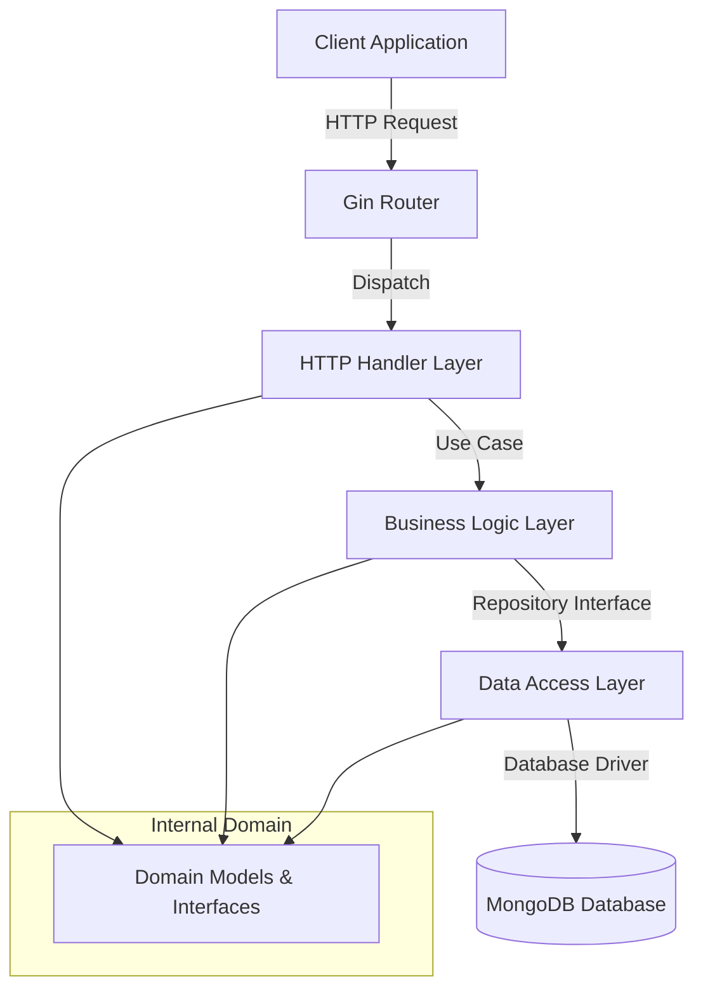

# System Context & Architecture

This document outlines the high-level architecture, component interactions, and core business logic of the HeartSteal backend.

## High-Level Architecture

The backend follows a Clean Architecture pattern, separating concerns into distinct layers:

## Key Modules

### Authentication Service
-   **Responsibility:** Handles user registration (`Signup`), login (`Login`), and JWT token generation/validation.
-   **Dependencies:** `UserUsecase`, `UserRepository`, `JWT Library`.

### User Management
-   **Responsibility:** Managing user profiles, avatars, and friend lists.
-   **Dependencies:** `UserUsecase`, `UserRepository`.

## Core Business Flows

### User Registration
1.  Client sends `POST /api/v1/auth/signup` with user details.
2.  Handler validates input structure.
3.  Usecase checks if email/username already exists via Repository.
4.  If unique, Usecase hashes password and calls Repository to save new user.
5.  Repository inserts document into MongoDB `users` collection.
6.  Handler returns success response.

### User Login
1.  Client sends `POST /api/v1/auth/login` with credentials.
2.  Handler validates input structure.
3.  Usecase retrieves user by email via Repository.
4.  Usecase compares hashed password.
5.  If valid, Usecase generates JWT access token.
6.  Handler returns token in success response.
